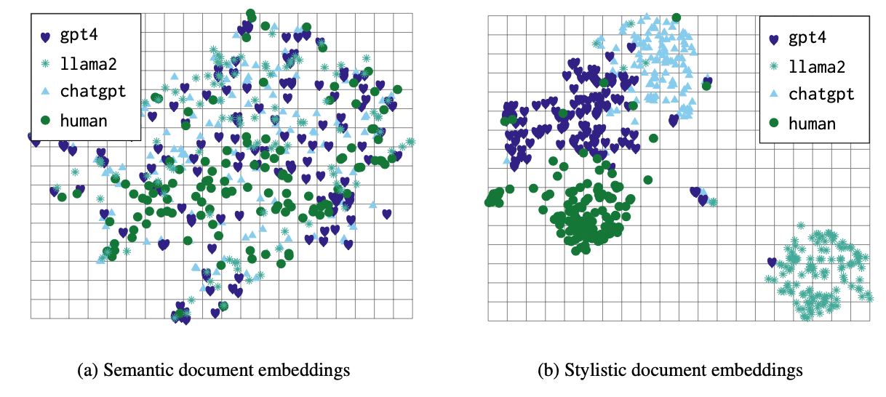

# Few-Shot Detection of Machine-Generated Text using Style Representations

This is the official repostiory for the ICLR 2024 paper titled [Few-Shot Detection of Machine-Generated Text using Style Representations](https://arxiv.org/abs/2401.06712). Our main contributions are twofold:

1. We show that stylistic features that distinguish human authors from one another also distinguish human authors from machine authors, and machine authors from each other. Our work explores various factors leading to effective style representations for this task, finding that contrastive training on large amounts of human-authored text is sufficient to obtain useful representations across a variety of few-shot settings.

2. In light of the *unavoidable* distribution shifts stemming from the introduction of new LLMs, topics, and domains, this work focuses on the few-shot setting. Our evaluations asses the ability to detect writing samples produced by LLM *unseen* at training time, drawn from new domains and topics. 

## The gist

The main gist is that stylistic representations estimated on human-authors are useful in distinguishing humans from machines, and machines from humans. You can see this in the following figure:



## Demo on ICLR 2024 reviews

To see how this would work in practice, we highly encourage you to look through our demo [here](https://colab.research.google.com/drive/1-Vv2wkSwbxXhQIgQ6tURNzfYbqc3AuBW).

## Environment setup

Install the Python (3.8) environment using the following commands: 
```bash
python3 -m venv mluar
source mluar/bin/activate
pip install -r requirements.txt
```

## Downloading datasets & setting up paths

To download datasets, pre-trained models, and set up the project paths, run the following script:
```bash
python download_and_setup_paths.py
```

This will download everything to `./data`, if you don't have enough space there, you may also download the files individually and set up the paths manually. If this is the case, please see the section titled "Individual download paths, and "file_config.ini" description".

## Quick-start

To quickly reproduce the UAR (Reddit 5M) results from Table 1, run the following commands:
```bash
cd evaluation/
./run_single_target_simple.sh
cd ../process_results/
./process_results_simple.sh
```

This will produce the following a pAUC of 0.868 for N=5, and a pAUC of 0.958 for N=10.

## Reproducing the main body of results

The following scripts will reproduce all the results in Table 1, Figure 2a, Figure 2b, and Figure 3.
```bash
cd evaluation/
./run_single_target.sh
./run_multiple_target.sh
./run_paraphrase.sh
cd ../process_results/
./process_all_results.sh
```

These scripts will run all the single-target, multiple-target, and paraphrasing experiments. Note that these scripts will run everything on a single GPU, thus it can take quite a while to run. If you have access to more resources, we'd recommend splitting the commands up into different machines.

Once the commands have finished, you will see a printout of all the relevant tables, and the plots will be saved under `./process_results/`.

## Training the baselines

We've already provided the pre-trained AI-Detector, PROTONET, and MAML baselines. However, if you wish to train your own, please read the README under the `baseline_training` folder.

## Individual download paths, and "file_config.ini" description


| Model / Dataset Name     | Download Link                                                    |
|--------------------------|------------------------------------------------------------------|
| AAC                      | https://drive.google.com/uc?id=14loxE_y5hzJB_EKYsnnA54xds-th7hSG |
| LWD                      | https://drive.google.com/uc?id=1s7ndF5zYGvBSjgs7RsiDoQhaAXbmCi8Q |
| Fewshot Data             | https://drive.google.com/uc?id=10RrYRqyBAKhLBlNEoDTlWmK_fJt-C1Ox |
| UAR Multi-domain         | https://drive.google.com/uc?id=1y0v9D7akL6e4ZlKnpvvwHCLQ8l7wQfbD |
| UAR Multi-LLM            | https://drive.google.com/uc?id=1EPwKG2sgOXXsU0d5GJte_TPjB-yB0ff1 |
| MAML                     | https://drive.google.com/uc?id=1Tfbzdp5VVqqbva2oyw8O3kMyHyQnpzJp |
| PROTONET                 | https://drive.google.com/uc?id=1GVO1Fj8lWukm8x3QK1uetchHh2JIDYT5 |
| AI Detector (fine-tuned) | https://drive.google.com/uc?id=1FSmWmJ4pMqpWD0fQN2gNYpop_OC5_QhI |

The `file_config.ini` contains the main application paths, here's a description of each field:

* aac_data_path - Path to the AAC data ("AAC" in the table above)
* lwd_data_path - Path to the LWD data ("LWD" in the table above)
* fewshot_data_path - Path to the Few-Shot data ("Fewshot Data" in the table above)
* weights_path - Path to the pre-trained models (folder containing the extracted files from the downloads of "MAML", "UAR Multi-domain", "UAR Multi-LLM", "AI Detector (fine-tuned)", and "PROTONET" above)

## Related Works

This work is based on our previous efforts in learning stylistic representations and studying their properties.
For more information, please see the following:

1. [Learning Universal Authorship Representaitons](https://aclanthology.org/2021.emnlp-main.70/)
2. [Can Authorship Representation Learning Capture Stylistic Features?](https://direct.mit.edu/tacl/article/doi/10.1162/tacl_a_00610/118299)

## Acknowledgements

Here's a list of the people who have contributed to this work: 
- [Olivia Miano](https://github.com/omiano)
- [Kailin Sun](https://github.com/kailinkoch)
- [Aleem Khan](https://aleemkhan62.github.io/)
- Barry Chen
- Marcus Bishop
- [Nicholas Andrews](https://www.cs.jhu.edu/~noa/)

## Citation

```
@misc{soto2024fewshot,
      title={Few-Shot Detection of Machine-Generated Text using Style Representations}, 
      author={Rafael Rivera Soto and Kailin Koch and Aleem Khan and Barry Chen and Marcus Bishop and Nicholas Andrews},
      year={2024},
      eprint={2401.06712},
      archivePrefix={arXiv},
      primaryClass={cs.CL}
}
```

## License

LUAR is distributed under the terms of the Apache License (Version 2.0).

All new contributions must be made under the Apache-2.0 licenses.

See LICENSE and NOTICE for details.

SPDX-License-Identifier: Apache-2.0

LLNL-CODE-844702

